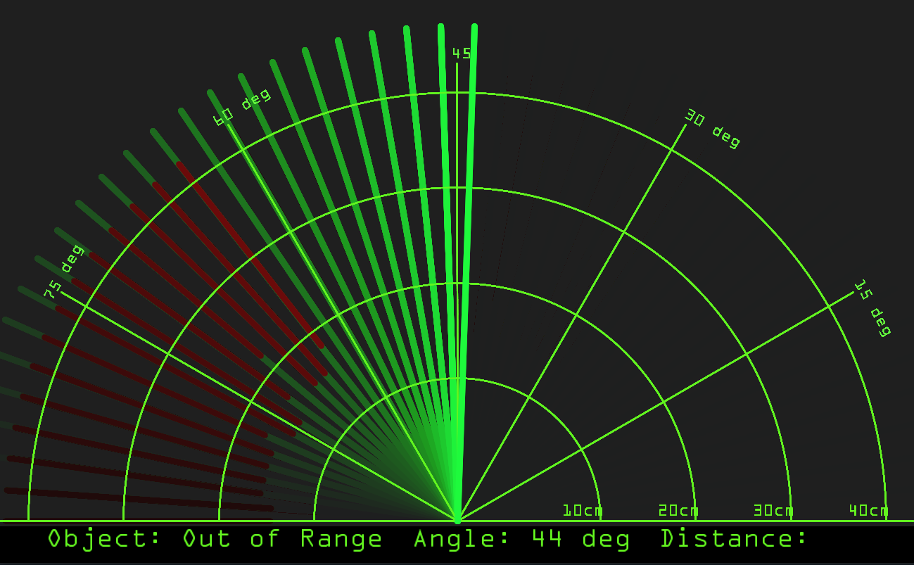

# sonarProject
A simple sonar using an Arduino to detect, lock, and track objects

Uses Arduino IDE for Arduino coding and Processing 4 for the UI

Upload sonarProject.ino to your Arduino via Arduino IDE
Ensure COM5 is the serial port for your Arduino

Open sonarProjectGUI.pde in Processing 4 (other Processing versions should work)

**HARDWARE:**
- Arduino UNO R4
- HC-SR04 Ultrasonic Sensor
- HC-SR04 Mounting Bracket (Optional/Highly Recommended)
- SG90 Servo
- Breadboard
- Hot Glue (Optional/Recommended)
- Jumper Wires
- Button
- Active Buzzer (Optional)
